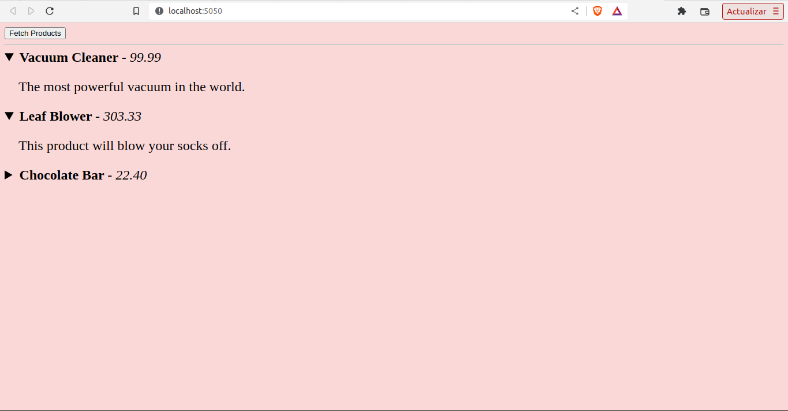
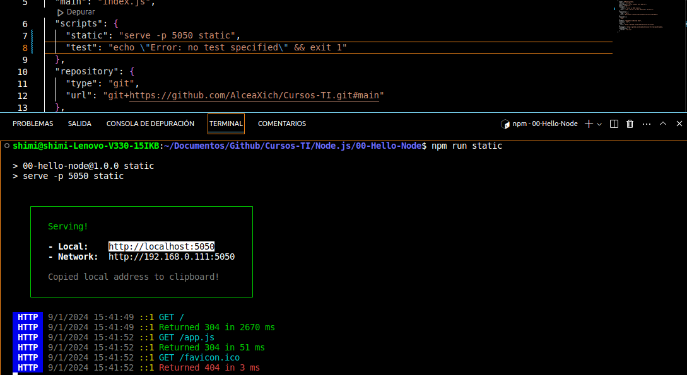
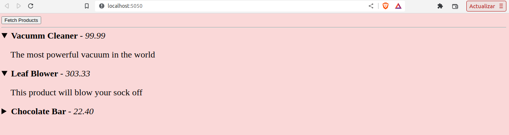

# Node.js
## Detalles
### Plataforma de aprendizaje
- Udemy - Building Nodejs API with MongoDB For Beginners
- EDx - Introduction to Node.js
### Tiempo de duracion
- Fecha inicio: 05-01-2024
- Fechan fin:

### Recursos
- [EDx - Introduction to Node.js](https://www.edx.org/learn/node-js/the-linux-foundation-introduction-to-node-js)
- [Udemy - Building Nodejs API with MongoDB For Beginners](https://www.udemy.com/course/nodejs-api-with-mongodb-for-beginners/)

## 1. Introducción a Node.js
### Set up Node en Linux
1. Instalar fnm: 
   * `$ curl -fsSL https://fnm.vercel.app/install | bash`
2. Verificar si fnm instalo correctamente: 
   * `$ fnm --version`
3. Intalar la último LTS (Long-Term Support) version de Node: 
   * `$ fnm install --lts`
4. Veificar si Node esta instalado: 
   * `$ node -v`

**Nota:** Para "fijar" una versión específica de Node.js para su proyecto, debe crear un archivo .nvmrc en la raíz del directorio de su proyecto.
### Empezando un proyecto Node
1. Para empezar un Node project, se necesita crear **package.json**, usando el siguiente comando: 
   * `npm init`.
2. Servir los archivos de una carpeta, usando serve: 
   * `npm install serve`.
3. Crear una nueva carpeta llamada static en el directorio de su proyecto:
   * `mkdir static`.
4. Crear 2 archivos dentro de la carpeta static:
   * index.html
   * app.js
5. Navegar hasta el directorio que contiene la carpeta static dentro de la terminal.
6. Para iniciar el servidor de archivos:
   * `npx serve -p 5050 static`
7. Navegar a: http://localhost:5050

### Creando comandos de shell de NPM
1. Para crear comandos de shell personalizados de Node Package Manager (NPM), se definen dentro del archivo **package.json**, específicamente en el objeto scripts.

2. En el script se encuentra los siguientes comandos:
   * **static** ejecuta serve -p 5050 static, que empieza el archivo servidor en el port 5050. 
   * **test**  muestra un mensaje de error.

3. Para ejecutar los comandos del script, dentro del terminal, se usa el siguiente comando, junto con el nombre del script:
   * `npm run static `

### Creando nuestro servicio web simulado 
   1. Crear un archivo **server.mjs** en la parte superior de la carpeta **static**. Asi deberia ser la estrutura del proyecto:
      - package-lock.json
      - package.json
      - server.mjs
      - static
        - app.js
        - index.html 
   2. Iniciamos el servicio simulado ejecutando en el terminal del directorio del proyecto:
      * `node server.mjs` 
   3. En otro terminar, usando npm:
      *  `npm run static`
   4. Navegamos a http://localhost:5050 en el navegador.

### Simulando Rutas GET
   1. Ahora, creemos un servicio web simulado usando Fastify para manejar las solicitudes GET.
   2. Eliminar el archivo server.mjs que creamos anteriormente:
      * `rm server.mjs`
   3. Modificar **static/index.html**.
   4. Modificar **static/app.js**, aqui se reemplazo el button-click.
   5. La función **populateProduct** ahora acepta un argumento de category y la llamada para recuperar se ha actualizado a:
      * const res = await fetch(`$(API)/${category}`)
        - GET http://localhost:5050/electronics 
        - GET http://localhost:5050/confectionery
   6. Crearemos, un servicio simulado usando Fastify framework.
   7. Crear el folder **mock-srv ** dentro del proyecto.
      * `mkdir mock-srv`
      * `cd mock-srv`
   8. Ahora intalamos el framework Fastity y su interfaz de linea de comandos:
      * `npm add fastity fastity-cli`
   9.  
## 2. Going real-time

### Mejora de un servidor HTTP con WebSockets (1)
   1. WebSockets permite la comunicación bidireccional entre navegadores y servidores. El protocolo WebSocket se construye sobre el protocolo HTTP. 
   2. Permite conexiones de larga duración que comienzan como conexiones HTTP normales y luego se actualizan a conexiones tipo socket.
   3. Actualizar **static/index.html**
   4. Ahora, actualizar el archivo **static/app.js** para establecer una conexión WebSocket del lado del cliente a nuestro servidor.
   5. ActuaLizar el archivo **mock-srv/routes/index.mjs**
## 3. Working with CLI

   1. Vamos a crear una herramienta de línea de comandos simple que realiza una solicitud POST al punto final /orders/{ID}.
   2. Creamos una carpeta en la raiz del proyecto, navegamos a la carpeta y luego inicializamos Node.js package:
      * `mkdir my-cli`
      * `cd my-cli`
      * `npm init -y`
   3. Usaremos el módulo "got" de NPM, que ofrece una API fácil de usar para desarrolladores para realizar solicitudes HTTP.
      * `npm install got `
   4. Crear detro my-cli el archivo cmd.js
   
